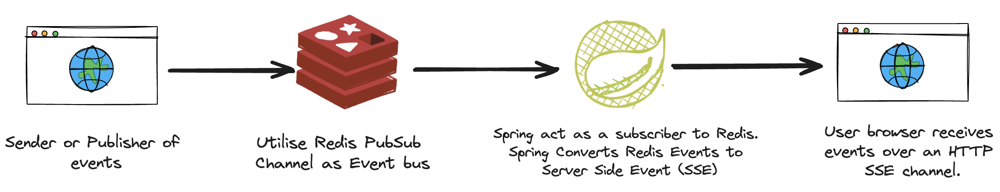
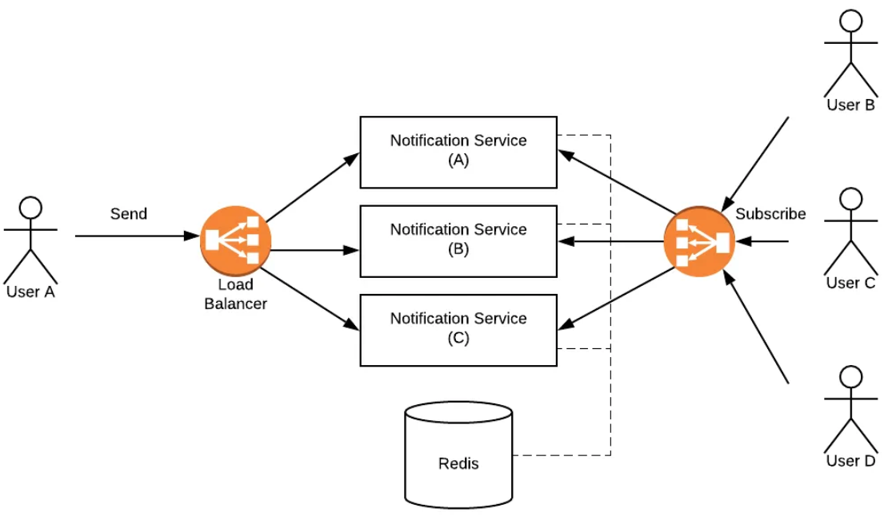

# Description

This project combines Server-Side Events with Redis PubSub for real-time push events to the browser.

The endgame is to have events published to a Redis PubSub channel. Spring is configured to subscribe to this channel, and convert any received events to HTTP Server-sent Events [SSE] which are subsequently sent to the React client in the browser.

# Components

## Server-Sent Events (SSE):

SSE maintain a long-lived connection between the client and server. When the client requests the SSE endpoint, the server responds with a content type of text/event-stream. This special content type tells the client to expect a stream of events rather than a single response.

SSE uses the HTTP/1.1 protocol, which supports persistent connections by default. This means the connection remains open for multiple requests/responses, rather than closing after each one.

The client establishes a long-lived HTTP connection to the server and keeps it open to receive updates. The client automatically reconnects if the connection is closed, ensuring reliability.

Each SSE connection is treated as a separate stream, and the server can maintain a list of these streams (emitters) to send events to all connected clients. Events are sent as plain text formatted as event-stream data.

## SseEmitter object

SseEmitter abstracts much of the low-level details, making it easier for developers to use SSE in their applications. The SseEmitter object is added to a service (emitService) that manages a collection of emitters. This service is responsible for sending events to all registered emitters. The SseEmitter object is returned to the client. The client will keep the connection open and receive events from the server.

### Life Cylce:

**Initialization**: When a request is made to an endpoint that returns an SseEmitter, Spring initializes the SseEmitter object. This object represents the open connection to the client.

**Open Connection**: The SseEmitter is initialized with a default or user-defined timeout value. This timeout determines how long the connection will remain open if no events are sent. Spring sets up the necessary HTTP headers to establish an SSE connection. This includes setting the Content-Type header to text/event-stream.

**Client Subscription**: When a client subscribes to the SSE endpoint, it includes a unique identifier (clientId) in the request. The server maps this clientId to the corresponding SseEmitter.

**Event Dispatching**: To send an event to a specific client, the server uses the clientId to look up the corresponding SseEmitter and sends the event through it.

**Event Transmission**: The server can send events to the client by calling the send method on the SseEmitter instance. The data is formatted according to the SSE protocol (e.g., with data: and event: prefixes). Each event sent through the SseEmitter is automatically transmitted to the connected client.

**Connection Close**: The connection can be closed by the server explicitly or if it times out or encounters an error. The client can also close the connection.

## EmitterService:

This service manages a list of SseEmitter instances. It provides methods to add new emitters and push notifications to clients. When a notification is pushed, it sends the notification to all registered emitters.

## RedisMessageSubscriber:

This class listens to messages from Redis. When a message is received, it deserializes the message to a RedisNotificationPayload object. It then calls the EmitterService to push the notification to the clients via SSE.

# Usecase

# Features

1. Landing page is a login screen. The client creates an EventSource object in JavaScript to connect to the server's endpoint. On Succesfull Login, the client establishes a long-lived HTTP connection to the server. 

# Screenshots

# Technology Stack

* Java  
* Spring Boot 
* Server Side Events 
* Redis pub/sub
* React 

