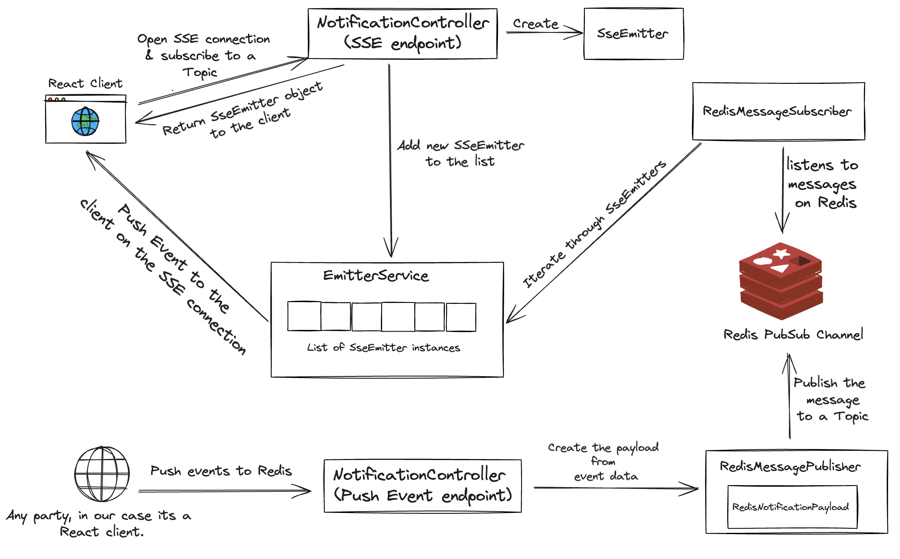
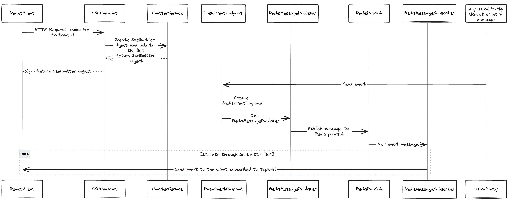
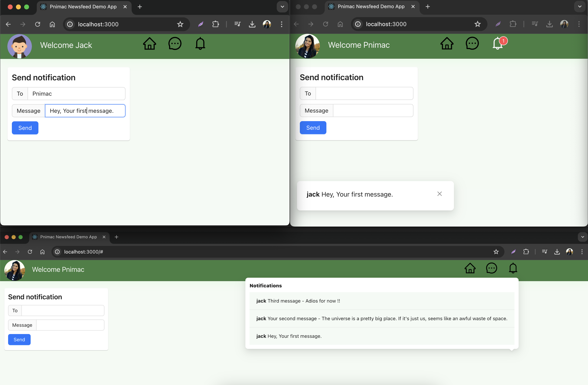

# About

This project combines Server-Side Events with Redis PubSub for real-time push events to the browser.

The endgame is to have events published to a Redis PubSub channel. Spring is configured to subscribe to this channel, and convert any received events to HTTP Server-sent Events [SSE] which are subsequently sent to the React client in the browser.

# Architecture

# Features

We are simulating a scalable realtime push notification feed in our application. 

1. Landing page is a login screen. On successfull login, user opens a long-lived HTTP SSE connection and subscribes for Notifications, username is used as the topic-id current user is interested in.

2. Second screen acts as a quick a tool to publish events from the browser to Redis pubsub channel, wherein the field "TO" should be the username (topic-id) to which the message (event) will be published to.

3. Multiple users can login parallely, send messages(events) to each other and simultaneously view push Notifications in their respective UI.  

4. The popup at the botttom-left of the user screen, count displayed on the bell-icon in menu bar and drop down on clicking the bell-icon gets updated in real-time.

# Components work-flow

## 1. Server-Sent Events (SSE):

SSE maintain a long-lived connection between the client and server. When the client requests the SSE endpoint, the server responds with a content type of text/event-stream. This special content type tells the client to expect a stream of events rather than a single response. The client automatically reconnects if the connection is closed, ensuring reliability.

## 2. SseEmitter object

SseEmitter in Spring abstracts much of the low-level details, making it easier for developers to use SSE in their applications. Life Cylce of this object includes:

* Initialization: When a request is made to an endpoint that returns an SseEmitter, Spring initializes the SseEmitter object. This object represents the open connection to the client.

* Open Connection: The SseEmitter is initialized with a default or user-defined timeout value. This timeout determines how long the connection will remain open if no events are sent. Spring sets up the necessary HTTP headers to establish an SSE connection. This includes setting the Content-Type header to text/event-stream.

* Client Subscription: When a client subscribes to the SSE endpoint, it includes a unique identifier (clientId) in the request. The server maps this clientId to the corresponding SseEmitter.

* Event Dispatching: To send an event to a specific client, the server uses the clientId to look up the corresponding SseEmitter and sends the event through it.

* Event Transmission: The server can send events to the client by calling the send method on the SseEmitter instance. The data is formatted according to the SSE protocol (e.g., with data: and event: prefixes). Each event sent through the SseEmitter is automatically transmitted to the connected client.

* Connection Close: The connection can be closed by the server explicitly or if it times out or encounters an error. The client can also close the connection.

## 4. EmitterService:

This service manages a list of SseEmitter instances. It provides methods to add new emitters and push notifications to clients. When a notification is pushed, it sends the notification to all registered emitters.

## 5. Redis PubSub:

Redis Pub/Sub (Publish/Subscribe) is a messaging pattern provided by Redis that allows messages to be sent and received between different clients in a decoupled manner.

## 6. RedisMessagePublisher:

The RedisMessagePublisher handles publishing messages to a Redis Pub/Sub channel. 

## 7. RedisMessageSubscriber:

This class listens to messages from Redis. When a message is received, it deserializes the message to a RedisNotificationPayload object. It then calls the EmitterService to push the notification to the clients via SSE.

# Screenshots

# Technology Stack

* Java  
* Spring Boot 
* Server Side Events 
* Redis pub/sub
* React 

# Prerequisite

* Ensure you have Maven installed. You can verify this by running `mvn -v` in your terminal.

* Ensure you have JDK installed. You can verify this by running `java -version` in your terminal.

* Ensure you have Node.js and npm (Node Package Manager) installed. You can verify this by running `node -v` and `npm -v` in your terminal.
  

# Testing

1. Navigate to the backend service project directory and run command:

`mvn clean install && mvn spring-boot:run`

2. Navigate to the React client project directory and run command:

`npm install && npm start`

